# **SDK 개발환경 설정**

---

## **준비물 : enuSpace SDK, Visual studio2019**
---

MFC(Microsoft Foundation Class) 기반의 프로젝트를 만듭니다.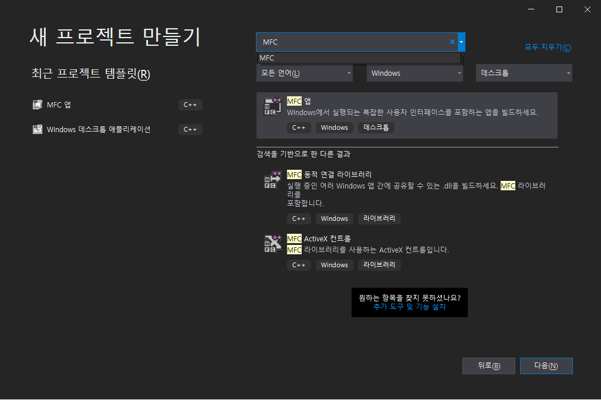

제목은 짓습니다.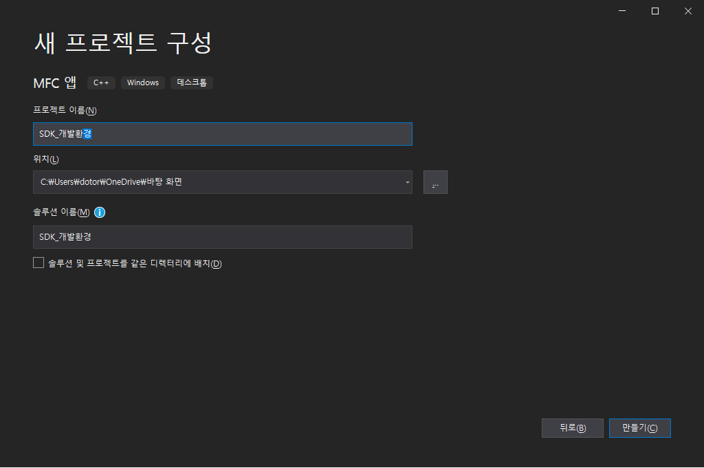

사용 목적에 맞게 설정을 합니다.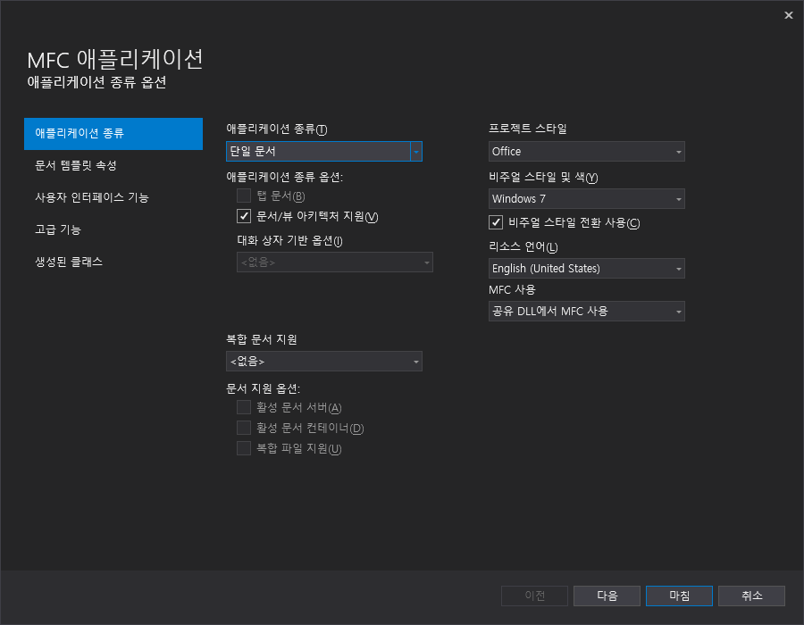

enuSpace SDK 폴더를 프로젝트 폴더에 넣습니다.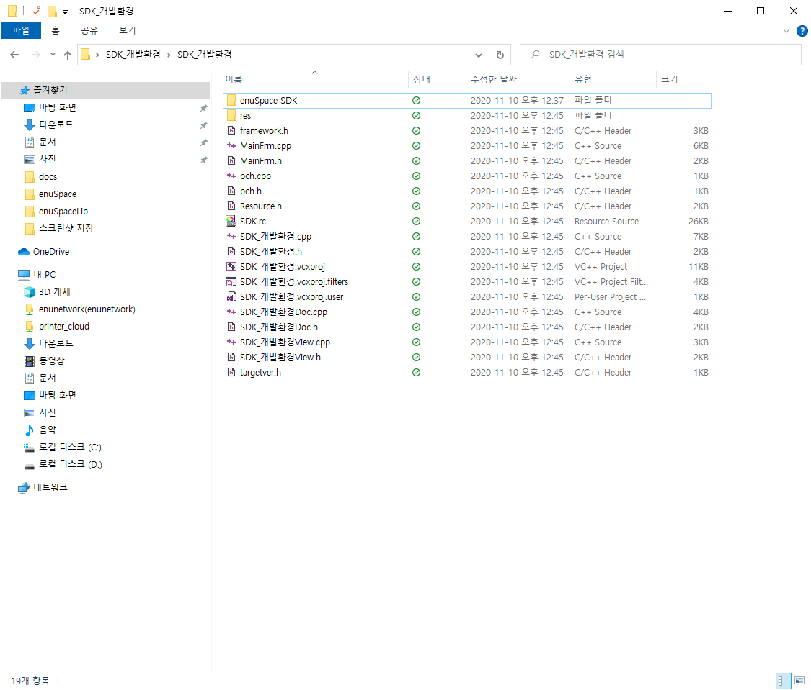

헤더파일 \(pch.h\)에 enuSpace SDK 파일을 추가합니다.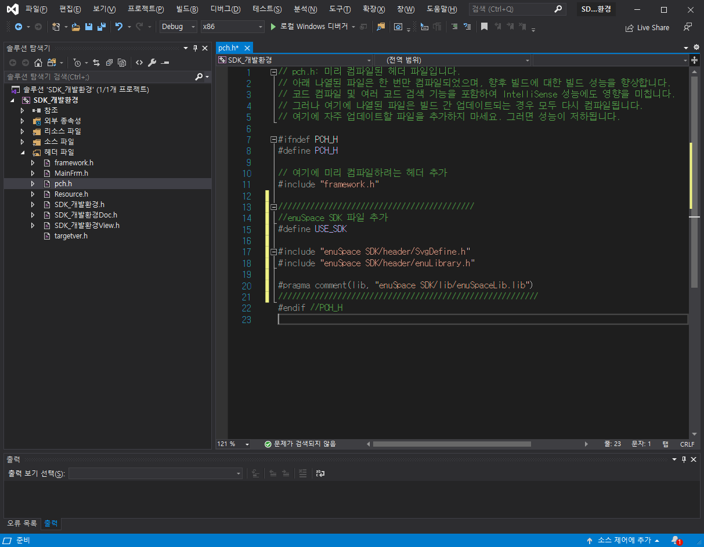

```cpp
#define USE_SDK

#include "enuSpace SDK/header/SvgDefine.h"
#include "enuSpace SDK/header/enuLibrary.h"

#pragma comment(lib, "enuSpace SDK/lib/enuSpaceLib.lib")
```
---

64비트로 빌드를 합니다.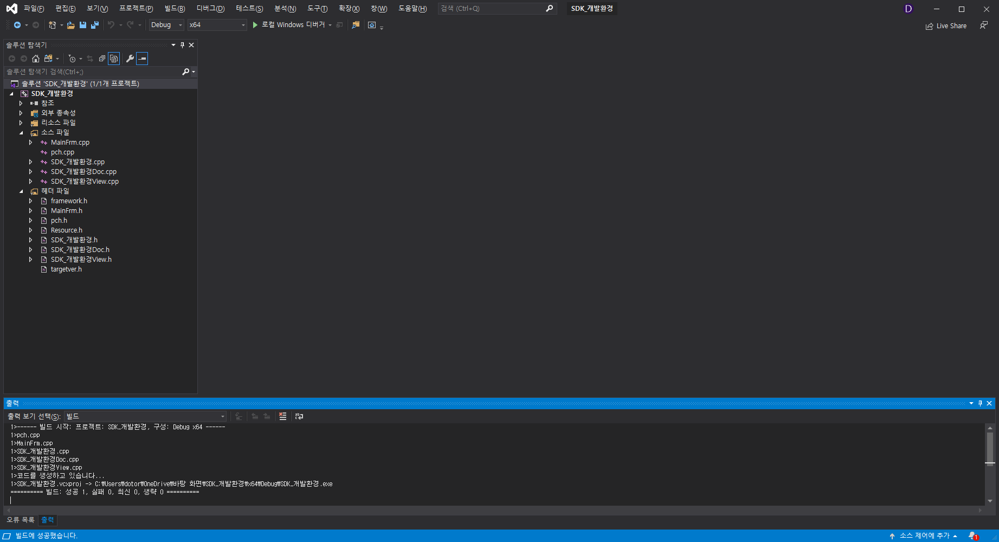

빌드후 생긴 폴더에 enuSpace SDK/bin에 있는 파일들을 복사해서 붙여넣기 합니다.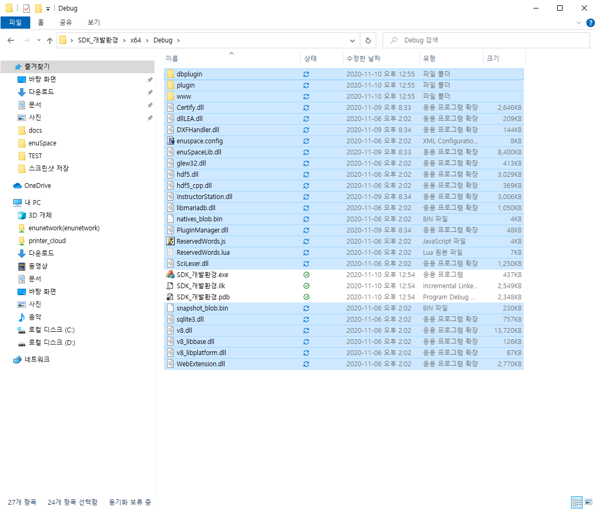

SDK_개발환경View.h(현재 사용중인 Project의 이름이 SDK_개발환경으로 지정했기 때문이다.)에 CSDK개발환경View 클래스에 가상함수 OnInitialUpdate()를 public으로 지정합니다.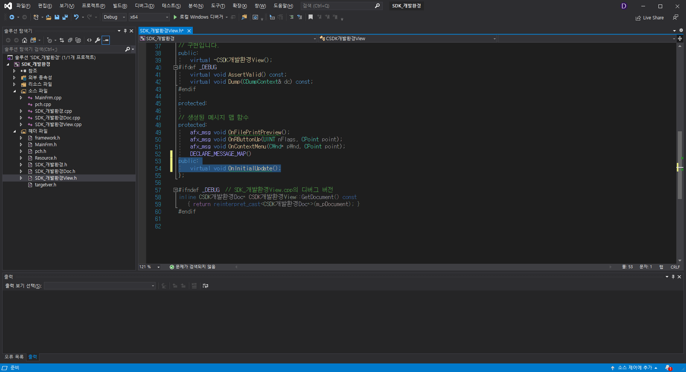

```cpp
class CSDK개발환경View : public CView
{
public:
	virtual void OnInitialUpdate();
};
```
---

SDK_개발환경View.cpp에 OnInitialUpdate()를 상속받는 CSDK개발환경View 함수를 만듭니다.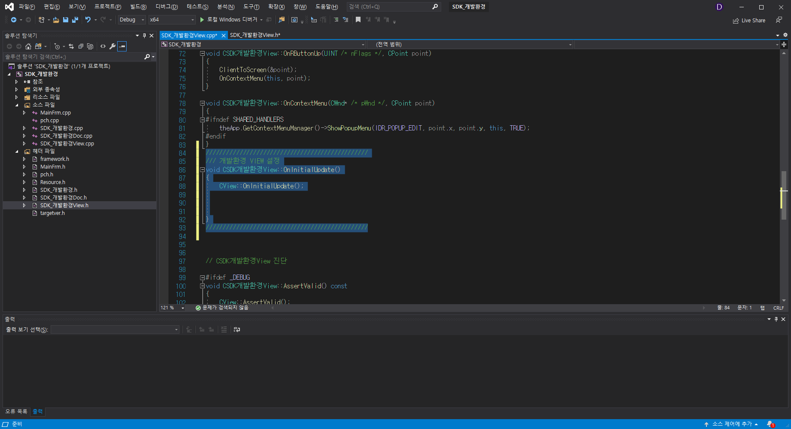

```cpp
////////////////////////////////////////////////
/// 개발환경 VIEW 설정
void CSDK개발환경View::OnInitialUpdate()
{
	CView::OnInitialUpdate();
	
}
////////////////////////////////////////////////
```
---

enuSpace.exe를 실행해서 새 프로젝트를 만들고, 그 프로젝트의 저장위치는 SDK_개발환경 실행 폴더로 합니다.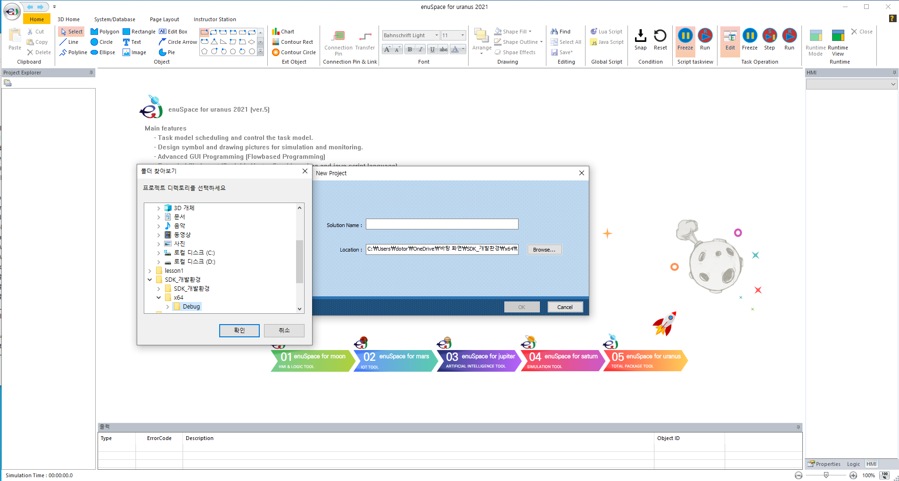

enuSpace로 VisualStudio MFC앱으로 실행하고자 하는 파일을 생성합니다.(필자는 Picture 폴더에 Main.svg파일을 생성했습니다.)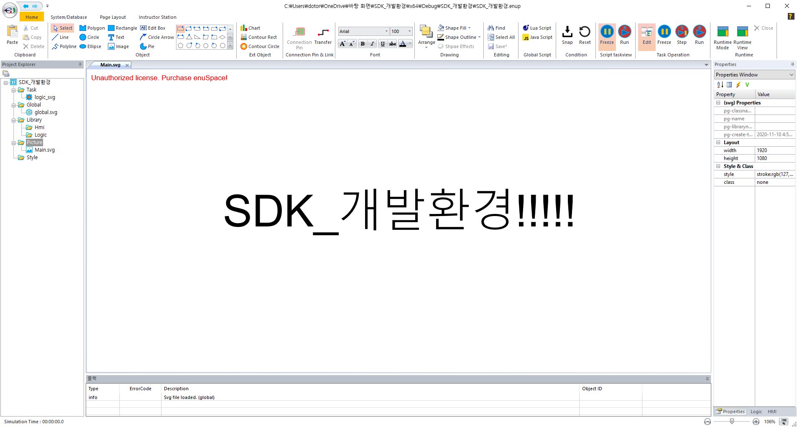

SDK_개발환경View.cpp에서 CSDK개발환경View 함수에 실행경로를 받아옵니다. strProjectName.Format함수로 실행하려는 enuSpace 생성파일 경로를 지정합니다.   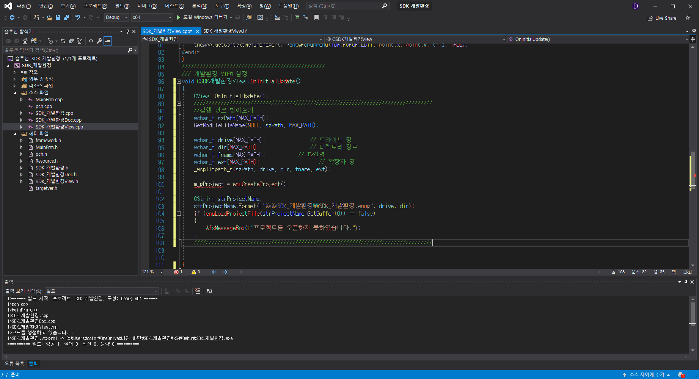

```cpp
////////////////////////////////////////////////
/// 개발환경 VIEW 설정
void CSDK개발환경View::OnInitialUpdate()
{
	CView::OnInitialUpdate();
	////////////////////////////////////////////////////////////////////////////////
	//실행 경로 받아오기
	wchar_t szPath[MAX_PATH];
	GetModuleFileName(NULL, szPath, MAX_PATH);

	wchar_t drive[MAX_PATH];               // 드라이브 명
	wchar_t dir[MAX_PATH];                 // 디렉토리 경로
	wchar_t fname[MAX_PATH];           // 파일명
	wchar_t ext[MAX_PATH];                    // 확장자 명
	_wsplitpath_s(szPath, drive, dir, fname, ext);

	m_pProject = enuCreateProject();

	CString strProjectName;
	strProjectName.Format(L"%s%sSDK_개발환경\\SDK_개발환경.enup", drive, dir);
	if (enuLoadProjectFile(strProjectName.GetBuffer(0)) == false)
	{
		AfxMessageBox(L"프로젝트를 오픈하지 못하였습니다.");
	}
	////////////////////////////////////////////////////////////////////////////////
}
////////////////////////////////////////////////

```
---

m_pProject 변수의 타입을 SDK_개발환경View.h의 CSDK개발환경View클래스에 HPROJECT로 m_pENUView의 변수 타입을 HVIEW로 지정합니다.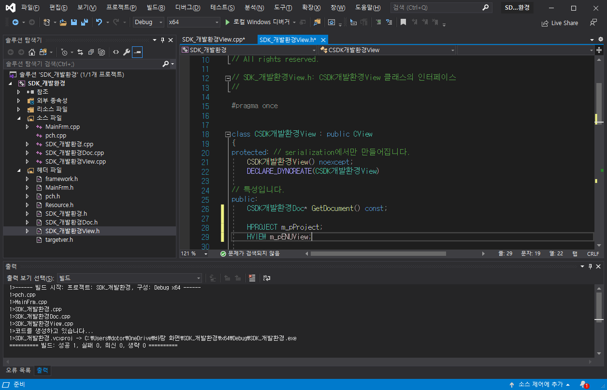
```cpp
class CSDK개발환경View : public CView
{
// 특성입니다.
public:
	HPROJECT m_pProject;
	HVIEW m_pENUView;

};
```
---

SDK_개발환경View.cpp에 View의 크기, 위치, view에 보여주려는 파일 등을 지정합니다.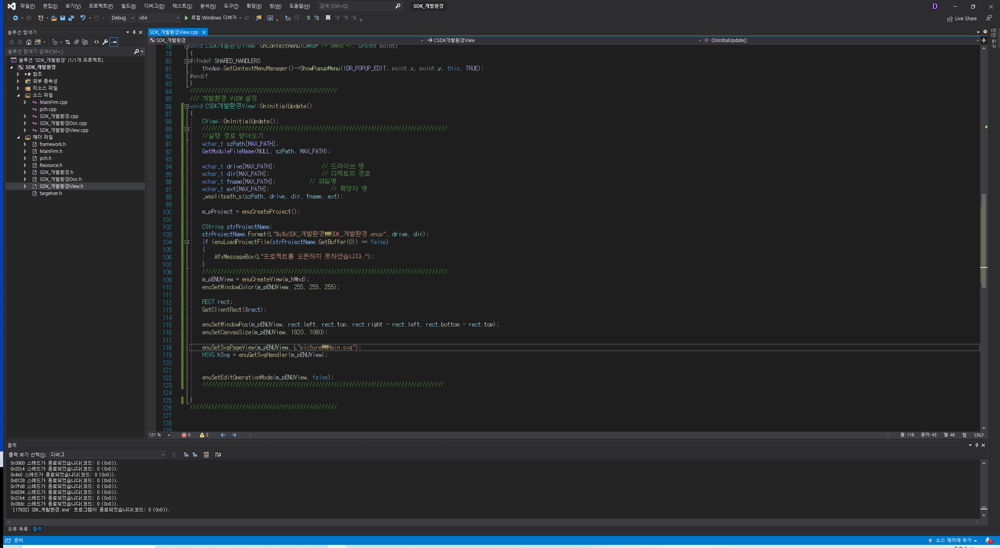
```cpp
////////////////////////////////////////////////
/// 개발환경 VIEW 설정
void CSDK개발환경View::OnInitialUpdate()
{
	CView::OnInitialUpdate();
	////////////////////////////////////////////////////////////////////////////////
	//실행 경로 받아오기
	wchar_t szPath[MAX_PATH];
	GetModuleFileName(NULL, szPath, MAX_PATH);

	wchar_t drive[MAX_PATH];               // 드라이브 명
	wchar_t dir[MAX_PATH];                 // 디렉토리 경로
	wchar_t fname[MAX_PATH];           // 파일명
	wchar_t ext[MAX_PATH];                    // 확장자 명
	_wsplitpath_s(szPath, drive, dir, fname, ext);

	m_pProject = enuCreateProject();

	CString strProjectName;
	strProjectName.Format(L"%s%sSDK_개발환경\\SDK_개발환경.enup", drive, dir);
	if (enuLoadProjectFile(strProjectName.GetBuffer(0)) == false)
	{
		AfxMessageBox(L"프로젝트를 오픈하지 못하였습니다.");
	}
	////////////////////////////////////////////////////////////////////////////////
	m_pENUView = enuCreateView(m_hWnd);
	enuSetWindowColor(m_pENUView, 255, 255, 255);

	RECT rect;
	GetClientRect(&rect);

	enuSetWindowPos(m_pENUView, rect.left, rect.top, rect.right - rect.left, rect.bottom - rect.top);
	enuSetCanvasSize(m_pENUView, 1920, 1080);

	enuSetSvgPageView(m_pENUView, L"picture\\Main.svg");
	HSVG hSvg = enuGetSvgHandler(m_pENUView);


	enuSetEditOperationMode(m_pENUView, false);
	///////////////////////////////////////////////////////////////////////////////

}
////////////////////////////////////////////////

```
---

SDK_개발환경View.h에 추가하려는 기능의 함수를 지정합니다.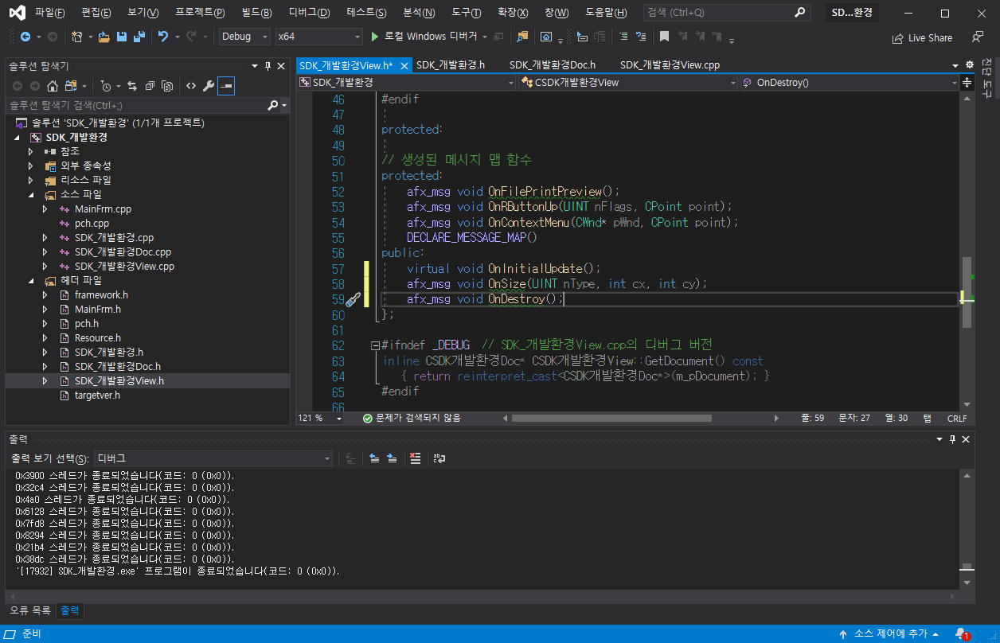
```cpp
class CSDK개발환경View : public CView
{
public:
	virtual void OnInitialUpdate();
	afx_msg void OnSize(UINT nType, int cx, int cy);
	afx_msg void OnDestroy();
};
```
---

SDK_개발환경View.cpp에 OnSize 기능과, OnDestroy기능을 추가합니다.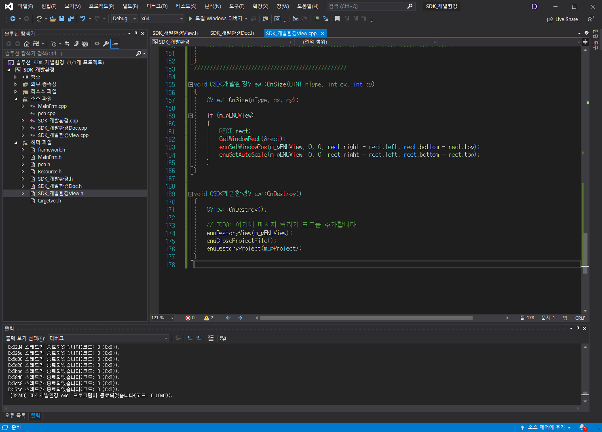
```cpp

void CSDK개발환경View::OnSize(UINT nType, int cx, int cy)
{
	CView::OnSize(nType, cx, cy);

	if (m_pENUView)
	{
		RECT rect;
		GetWindowRect(&rect);
		enuSetWindowPos(m_pENUView, 0, 0, rect.right - rect.left, rect.bottom - rect.top);
		enuSetAutoScale(m_pENUView, 0, 0, rect.right - rect.left, rect.bottom - rect.top);
	}
}


void CSDK개발환경View::OnDestroy()
{
	CView::OnDestroy();

	// TODO: 여기에 메시지 처리기 코드를 추가합니다.
	enuDestoryView(m_pENUView);
	enuCloseProjectFile();
	enuDestoryProject(m_pProject);
}

```